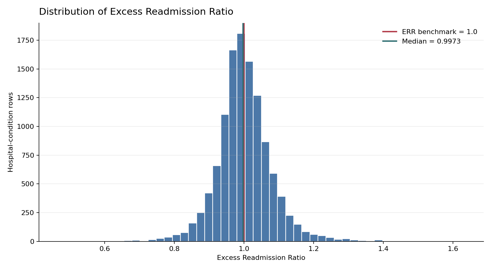
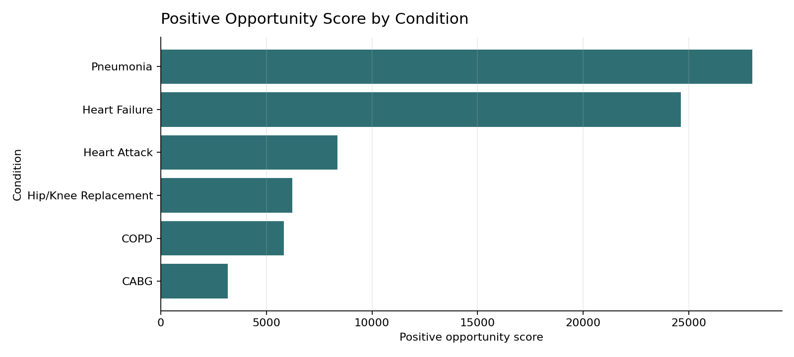
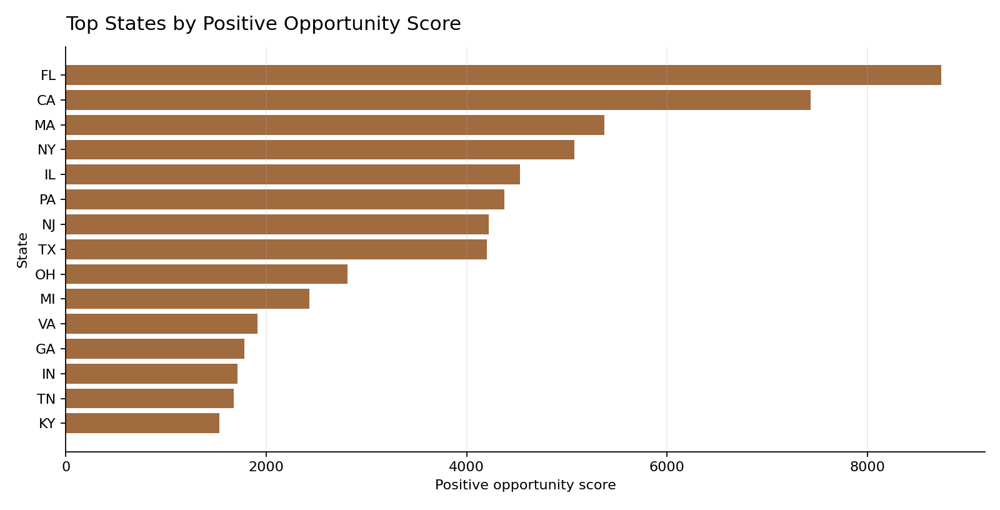
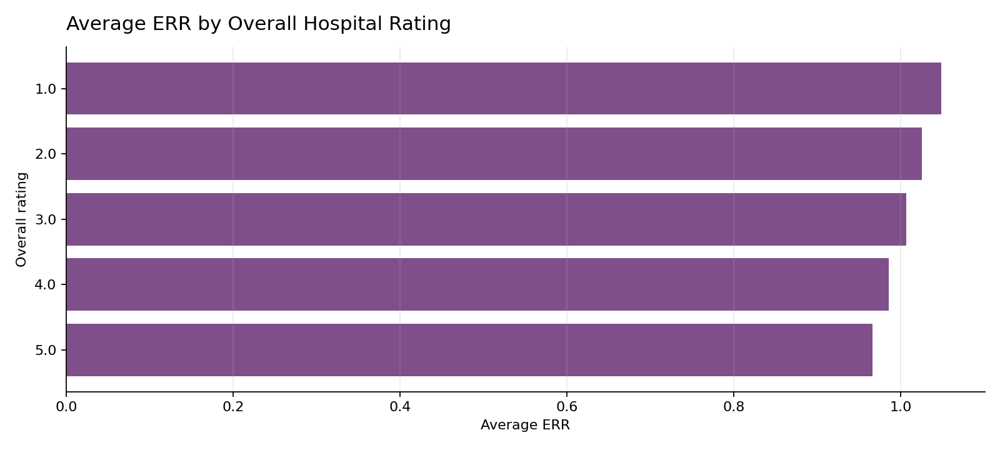
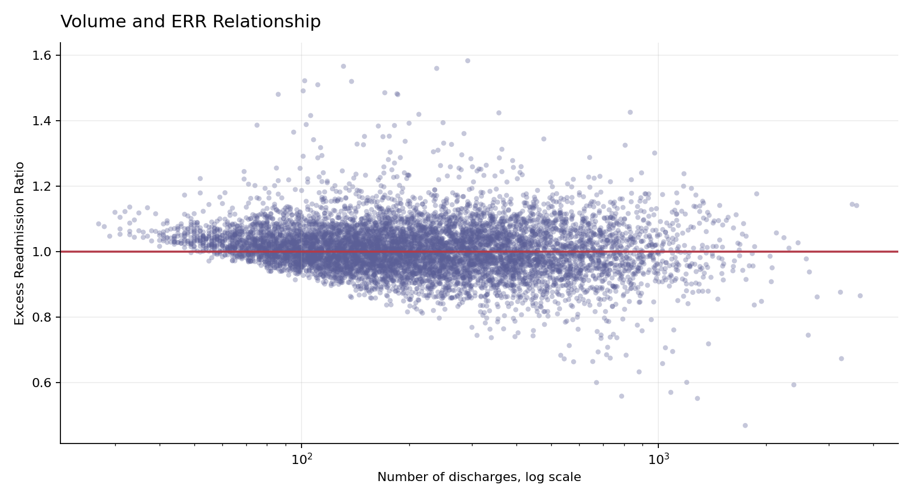

# EDA And Statistical Analysis: CMS Hospital Readmissions

## Executive Summary

- **Readmissions opportunity is concentrated by condition.** Pneumonia has the largest directional opportunity score (28,010.8), followed by Heart Failure; together they account for most of the measured positive opportunity in this dataset.
- **Geographic opportunity is concentrated in large and high-ERR markets.** FL has the highest state-level opportunity score (8,737.0), with CA, MA, NY, and IL also ranking near the top.
- **Hospital rating is strongly associated with ERR.** One-star hospitals average ERR 1.0484, while five-star hospitals average ERR 0.9663; the Kruskal-Wallis test finds statistically different ERR distributions by rating.
- **Volume has only a weak monotonic relationship with ERR.** Spearman rho is -0.1606, so volume matters more for sizing opportunity than for explaining risk-adjusted readmission performance.

## Context And Method

The analysis uses the cleaned CMS HRRP analytic table at hospital-condition grain. ERR is interpreted as the risk-adjusted readmission performance measure, where values above 1.0 indicate excess readmissions versus expected performance for similar patients.

Statistical comparisons use Kruskal-Wallis tests because ERR is bounded, skewed, and segmented across categorical hospital characteristics. Volume correlation uses Spearman rank correlation. These tests indicate association, not causality.

## National Picture

| metric | value |
| --- | --- |
| Hospital-condition rows with numeric ERR | 11,720 |
| Hospitals with at least one numeric ERR | 2,833 |
| Average ERR | 1.0018 |
| Median ERR | 0.9973 |
| Rows above ERR benchmark | 48.1% |
| Rows at or above ERR 1.05 | 21.8% |
| Reported numeric readmissions | 391,809 |
| Positive opportunity score | 76,251.4 |

The national ERR distribution is centered very close to 1.0, which is expected for a risk-adjusted benchmark. The business question is therefore not whether the national average is extreme; it is where excess performance combines with enough volume to create addressable improvement opportunity.

## Conditions Driving Opportunity

| condition | rows | hospitals | avg_err | median_err | pct_err_gt_1 | readmissions | discharges | opportunity |
| --- | --- | --- | --- | --- | --- | --- | --- | --- |
| Pneumonia | 2715 | 2715 | 1.0015 | 0.9955 | 0.4681 | 131428.0 | 811908.0 | 28010.7996 |
| Heart Failure | 2621 | 2621 | 1.0014 | 0.9983 | 0.4891 | 169065.0 | 858817.0 | 24620.8364 |
| Heart Attack | 1736 | 1736 | 1.0018 | 0.9994 | 0.4965 | 36231.0 | 268260.0 | 8369.2051 |
| Hip/Knee Replacement | 1447 | 1447 | 1.004 | 0.9916 | 0.4789 | 4998.0 | 107291.0 | 6226.3432 |
| COPD | 2323 | 2323 | 1.0011 | 0.9969 | 0.4722 | 42934.0 | 224493.0 | 5839.2638 |
| CABG | 878 | 878 | 1.0018 | 1.0 | 0.4989 | 7153.0 | 65148.0 | 3184.9574 |

Pneumonia and Heart Failure dominate the positive opportunity ranking because they combine high readmission volume with many hospitals above benchmark. CABG has a similar average ERR, but much lower volume, so its portfolio-level opportunity is smaller.

## Geography

| state | hospitals | avg_err | pct_err_gt_1 | readmissions | opportunity |
| --- | --- | --- | --- | --- | --- |
| FL | 164 | 1.0229 | 0.5746 | 35222.0 | 8737.0262 |
| CA | 253 | 1.0101 | 0.552 | 33249.0 | 7433.8654 |
| MA | 52 | 1.0344 | 0.625 | 15668.0 | 5377.0252 |
| NY | 124 | 1.0019 | 0.5269 | 23521.0 | 5078.5532 |
| IL | 109 | 1.0194 | 0.5784 | 20558.0 | 4530.7453 |
| PA | 126 | 1.0069 | 0.5101 | 18208.0 | 4380.1135 |
| NJ | 61 | 1.0277 | 0.6544 | 15078.0 | 4222.3679 |
| TX | 244 | 1.0043 | 0.4955 | 26324.0 | 4203.1303 |
| OH | 111 | 1.0085 | 0.5198 | 15899.0 | 2812.4267 |
| MI | 83 | 1.0054 | 0.4807 | 12337.0 | 2428.4041 |
| VA | 69 | 0.9943 | 0.4437 | 12509.0 | 1911.8775 |
| GA | 88 | 1.0114 | 0.5578 | 10771.0 | 1780.162 |
| IN | 76 | 0.9976 | 0.4517 | 10180.0 | 1712.0761 |
| TN | 71 | 1.0054 | 0.5088 | 9281.0 | 1676.0726 |
| KY | 59 | 1.0101 | 0.5419 | 7223.0 | 1531.3632 |

Florida, California, Massachusetts, New York, and Illinois are the strongest initial geographic targets. This does not mean every hospital in those states performs poorly; it means the combination of excess ERR and volume is largest there.

## Hospital Characteristics

| rating_label | overall_rating_group | hospitals | avg_err | median_err | pct_err_gt_1 | opportunity |
| --- | --- | --- | --- | --- | --- | --- |
| 1.0 | Low Rating | 169 | 1.0484 | 1.035 | 0.7255 | 7448.9854 |
| 2.0 | Low Rating | 567 | 1.0249 | 1.0177 | 0.6106 | 22068.0668 |
| 3.0 | Middle Rating | 840 | 1.0061 | 1.0 | 0.4993 | 24906.7138 |
| 4.0 | Middle Rating | 758 | 0.9856 | 0.9847 | 0.3883 | 15847.5655 |
| 5.0 | High Rating | 287 | 0.9663 | 0.9687 | 0.3069 | 5028.1377 |
| Missing Rating |  | 212 | 0.9838 | 0.9919 | 0.4261 | 951.9363 |

| hospital_ownership | hospitals | avg_err | median_err | pct_err_gt_1 | opportunity |
| --- | --- | --- | --- | --- | --- |
| Missing Hospital Attributes | 15 | 1.0303 | 1.0149 | 0.6154 | 323.4166 |
| Proprietary | 544 | 1.017 | 1.0081 | 0.5495 | 13842.3237 |
| Government - Federal | 13 | 1.0032 | 1.0177 | 0.5897 | 259.4552 |
| Government - Local | 129 | 1.0026 | 1.0045 | 0.5278 | 1719.403 |
| Government - State | 37 | 1.0008 | 1.0055 | 0.521 | 948.6734 |
| Government - Hospital District or Authority | 206 | 0.9998 | 0.9965 | 0.4746 | 3540.1121 |
| Voluntary non-profit - Private | 1404 | 0.999 | 0.9947 | 0.4647 | 44865.7754 |
| Voluntary non-profit - Other | 229 | 0.9987 | 0.9952 | 0.4605 | 4930.2514 |
| Voluntary non-profit - Church | 195 | 0.9942 | 0.9884 | 0.4375 | 5425.047 |
| Tribal | 5 | 0.9756 | 0.9756 | 0.3 | 0.0 |
| Physician | 56 | 0.9535 | 0.9788 | 0.3789 | 396.9477 |

Rating shows the clearest directional relationship: lower-rated hospitals have higher ERR and a larger share of rows above benchmark. Ownership differences are statistically detectable but should be interpreted cautiously because ownership categories differ in size, hospital mix, and case volume.

## Volume Relationship

Spearman correlation between discharges and ERR is -0.1606 with p-value <0.001 across 8,037 rows. The relationship is statistically significant but weak, so volume should be used primarily to size intervention opportunity rather than to infer worse performance.

## Statistical Tests

| grouping | groups_tested | n | h_statistic | p_value | epsilon_squared | interpretation |
| --- | --- | --- | --- | --- | --- | --- |
| condition | 6 | 11720 | 6.9311 | 0.2258 | 0.0002 | No statistically significant difference detected |
| state | 49 | 11665 | 644.5622 | <0.001 | 0.0514 | Statistically different ERR distributions |
| hospital_ownership | 9 | 11671 | 110.0529 | <0.001 | 0.0088 | Statistically different ERR distributions |
| hospital_overall_rating | 5 | 11436 | 869.5488 | <0.001 | 0.0757 | Statistically different ERR distributions |
| overall_rating_group | 3 | 11436 | 708.7758 | <0.001 | 0.0618 | Statistically different ERR distributions |

The tests support differences in ERR distributions across state, ownership, and rating groups, but not across condition groups at the 0.05 threshold. Conditions differ more in portfolio opportunity because of volume and case availability than because their ERR distributions are clearly separated. Effect sizes are small to moderate, which is common in large operational datasets: statistical significance is not the same as operational importance.

## Hospital Opportunity Targets

| facility_id | facility_name | state | condition | excess_readmission_ratio | number_of_discharges | positive_opportunity_score | hospital_overall_rating | hospital_ownership |
| --- | --- | --- | --- | --- | --- | --- | --- | --- |
| 100007 | ADVENTHEALTH ORLANDO | FL | Pneumonia | 1.1409 | 3588.0 | 505.5 | 3.0 | Voluntary non-profit - Private |
| 100007 | ADVENTHEALTH ORLANDO | FL | Heart Failure | 1.1447 | 3487.0 | 504.6 | 3.0 | Voluntary non-profit - Private |
| 050030 | OROVILLE HOSPITAL | CA | Pneumonia | 1.4255 | 833.0 | 354.4 | 1.0 | Voluntary non-profit - Private |
| 220100 | SOUTH SHORE HOSPITAL | MA | Pneumonia | 1.1766 | 1883.0 | 332.5 | 2.0 | Voluntary non-profit - Private |
| 330194 | MAIMONIDES MEDICAL CENTER | NY | Pneumonia | 1.3011 | 975.0 | 293.6 | 2.0 | Voluntary non-profit - Private |
| 490022 | MARY WASHINGTON HOSPITAL | VA | Pneumonia | 1.238 | 1178.0 | 280.4 | 3.0 | Voluntary non-profit - Private |
| 100260 | ST LUCIE MEDICAL CENTER | FL | Hip/Knee Replacement | 1.3249 | 806.0 | 261.9 | 1.0 | Proprietary |
| 330198 | MOUNT SINAI SOUTH NASSAU | NY | Pneumonia | 1.1933 | 1236.0 | 238.9 | 3.0 | Voluntary non-profit - Private |
| 310022 | WEST JERSEY HOSPITAL | NJ | Heart Failure | 1.1999 | 1175.0 | 234.9 | 3.0 | Voluntary non-profit - Private |
| 310041 | COMMUNITY MEDICAL CENTER | NJ | Heart Failure | 1.1729 | 1272.0 | 219.9 | 1.0 | Voluntary non-profit - Private |
| 210001 | MERITUS MEDICAL CENTER | MD | Pneumonia | 1.2406 | 896.0 | 215.6 | 3.0 | Voluntary non-profit - Private |
| 310041 | COMMUNITY MEDICAL CENTER | NJ | Pneumonia | 1.1412 | 1483.0 | 209.4 | 1.0 | Voluntary non-profit - Private |
| 390133 | LEHIGH VALLEY HOSPITAL | PA | Pneumonia | 1.154 | 1329.0 | 204.7 | 4.0 | Voluntary non-profit - Private |
| 220077 | BAYSTATE MEDICAL CENTER | MA | Heart Attack | 1.1792 | 1124.0 | 201.4 | 2.0 | Voluntary non-profit - Private |
| 050239 | GLENDALE ADVENTIST MEDICAL CENTER | CA | Pneumonia | 1.1485 | 1336.0 | 198.4 | 4.0 | Voluntary non-profit - Private |
| 230269 | BEAUMONT HOSPITAL, TROY | MI | Heart Failure | 1.1127 | 1649.0 | 185.8 | 4.0 | Voluntary non-profit - Private |
| 390133 | LEHIGH VALLEY HOSPITAL | PA | Hip/Knee Replacement | 1.2876 | 641.0 | 184.4 | 4.0 | Voluntary non-profit - Private |
| 390115 | JEFFERSON HEALTH- NORTHEAST | PA | Heart Failure | 1.2197 | 839.0 | 184.3 | 2.0 | Voluntary non-profit - Private |
| 070025 | HARTFORD HOSPITAL | CT | Heart Failure | 1.1395 | 1305.0 | 182.0 | 4.0 | Voluntary non-profit - Private |
| 450324 | TEXOMA MEDICAL CENTER | TX | Pneumonia | 1.1744 | 1026.0 | 178.9 | 4.0 | Proprietary |

These hospital-condition rows are good starting points for intervention review because they combine excess ERR with enough volume to matter. They should be validated against local service-line context, discharge planning programs, payer mix, and care-transition resources before turning into action plans.

## Caveats

- CMS suppresses many low-volume rows, so volume-based opportunity scores only apply where ERR and discharges are numeric.
- The opportunity score is directional, not a direct estimate of avoidable readmission count or financial penalty exposure.
- Statistical tests are association tests and do not prove that rating, ownership, geography, or condition causes readmission differences.
- The HRRP measurement period is July 1, 2021 through June 30, 2024; results should not be described as current live performance.

## Recommended Next Step

Use the EDA findings to design the Power BI dashboard around four executive questions: where opportunity is concentrated nationally, which conditions drive it, which hospital characteristics are associated with performance, and which hospital-condition rows should be prioritized for review.
